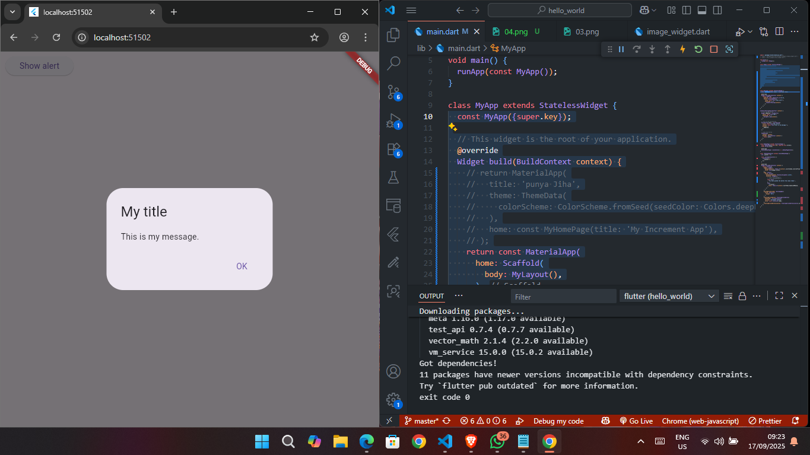

# hello_world

A new Flutter project.

# Menjalankan aplikasi hello_world pada perangkat fisik

# Praktikum 4: Menerapkan Widget Dasar

#### Langkah 1: Text Widget

#### Langkah 2: Image Widget

# Praktikum 5: Menerapkan Widget Material Design dan iOS Cupertino

#### Langkah 3: Scaffold Widget

#### Langkah 4: Dialog Widget

#### Langkah 5: Input dan Selection Widget

#### Langkah 6: Date and Time Pickers

